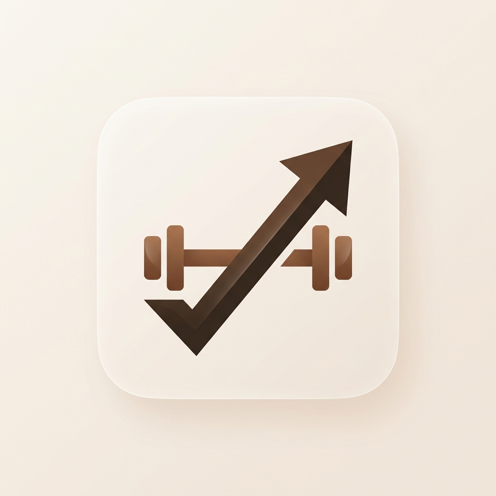
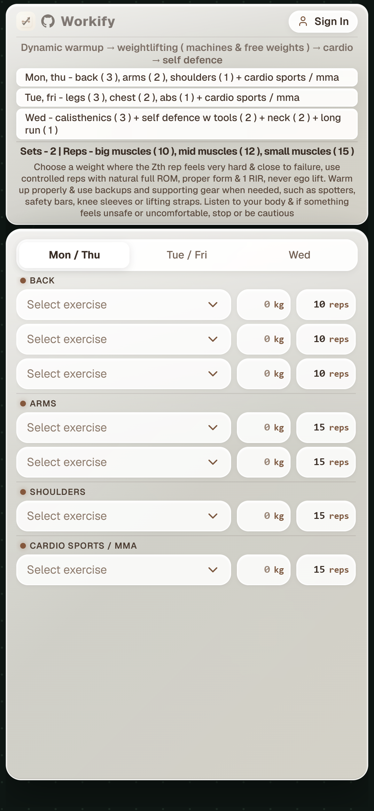
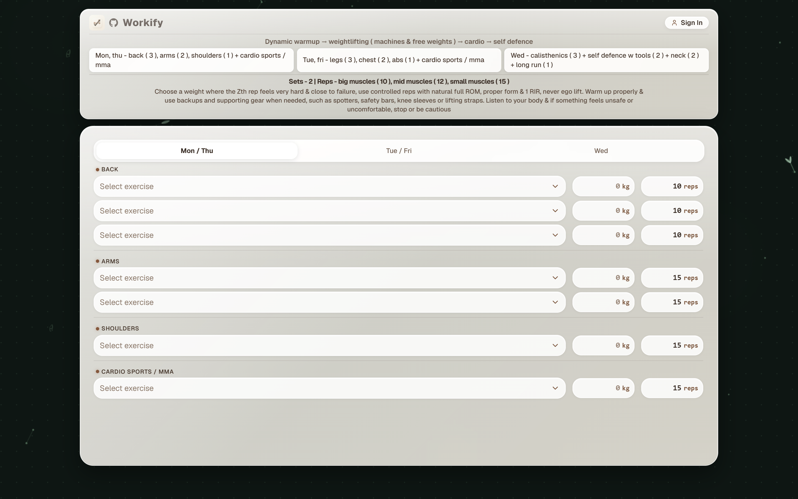

<p align="center">
  
</p>

<h1 align="center">Workify</h1>

<p align="center">
  A clean, aesthetic workout tracker built with React, TypeScript, and Tailwind CSS.<br/>
  Liquid glass UI · warm beige palette · dynamic ambient background · mobile-first.
</p>

---

## Preview

### Mobile

<p align="center">
  
</p>

### Desktop

<p align="center">
  
</p>

---

## Features

- **Liquid Glass UI** — frosted glass cards, soft rounded inputs, and subtle backdrop blur effects
- **Dynamic Background** — animated floating shapes with a warm beige-to-brown gradient
- **Continuous Card Layout** — unified, unbroken liquid-glass container for the entire app
- **3-Day Split Tracker** — Mon/Thu, Tue/Fri, Wed rotation with muscle group categorization
- **Strictly Isolated Custom Exercises** — add custom exercises per muscle group, isolated to their respective section
- **Weight Logging with Quick `+1` & `+2`** — inline "kg" badge with dedicated `+1` and `+2` increment buttons
- **Rep Logging with Target Caps** — track reps capped at muscle group default targets (10, 12, 15)
- **Supabase Auth** — optional sign-in to sync workout data across devices
- **Mobile-First & Responsive** — locked viewport, optimized touch targets, scales from mobile to desktop

---

## 🤖 AI Prompt (Copy & Paste)

Want to build or scaffold this exact app using **VS Code "Codex" / Copilot**, **Google Antigravity**, **ChatGPT**, **Claude**, or **Cursor**? Copy and paste the prompt below:

````markdown
```text
Build a modern, aesthetic workout tracking web application called "Workify" using React 19, TypeScript, and Tailwind CSS.

### 🎨 1. Visual Aesthetic & Liquid Glass Design System
- Theme: Warm beige, oatmeal, espresso, and latte tones (#F5EFEB background, #382C24 deep espresso text, #7C583F warm amber-brown accents, #D4C3B3 borders).
- Liquid Glass: Translucent frosted glass surfaces using backdrop blur (`backdrop-blur-xl`), delicate borders (`border border-white/40`), subtle glowing highlights, and soft rounded corners.
- Dynamic Ambient Background: Fluid, slowly floating organic shapes drifting in the background behind the main container.
- Unified Card Container: The entire app resides inside ONE continuous, seamless liquid-glass card without broken gaps or disjointed halves.

### 🏋️ 2. Workout Split & Routine Structure
A structured 3-day split rotation:
- Mon / Thu: Back (3 exercise slots), Arms (3 exercise slots), Shoulders (2 exercise slots)
- Tue / Fri: Legs (4 exercise slots), Calves (2 exercise slots), Abs (2 exercise slots)
- Wed: Chest (4 exercise slots), Triceps (2 exercise slots), Biceps (2 exercise slots)

### 📋 3. Header & Brand Overview
- Prominent "Workify" heading with a clickable GitHub logo icon on the right.
- High-intensity routine guidelines:
  - "Split: Mon/Thu (Back/Arms/Shoulders) · Tue/Fri (Legs/Calves/Abs) · Wed (Chest/Arms)"
  - "Goal: 2 working sets to absolute failure. Optional dropset on final set. 10-15 reps."

### 🔄 4. Day Selector Tabs
- Minimalist glass pill switcher for [Mon / Thu], [Tue / Fri], and [Wed].
- Smooth state switching displaying the relevant muscle groups and exercise slots for the selected day.

### ⚡ 5. Exercise Slots & Interactive Controls
Each exercise slot in the workout table contains:
1. Custom Aesthetic Dropdown (AestheticSelect):
   - Starts with placeholder "Select exercise".
   - Shows predefined muscle-group exercises plus user-added custom exercises.
   - Inline "+ Add Exercise" input allows instant custom exercise creation.
   - Strict Muscle-Group Isolation: Exercises added to a section (e.g. Back) remain strictly isolated to that section and NEVER bleed into other sections (e.g. Arms).
   - Custom exercises include an option to remove/delete them.
2. Weight (KG) Box + Quick Increments (+1 & +2):
   - Rounded glass numeric input with an embedded "kg" badge inside the right of the box.
   - Dedicated "+1" and "+2" quick stepper buttons placed directly on the right of the KG box to increment weight by 1 kg or 2 kg in one click.
3. Reps Box:
   - Numeric input with an embedded "reps" badge inside the right of the box.
   - Reps are capped at the muscle group's default target (e.g. max 10 for Back/Chest, max 12 for Arms/Shoulders, max 15 for Calves/Abs).

### 💾 6. Persistence & Features
- Automatic auto-save: All exercise selections, weights, and reps automatically persist to localStorage on every change.
- Workout history drawer showing past logged sessions.
- Optional Supabase authentication modal for user sign-in and cross-device sync.
- Mobile-first, fully responsive layout that fits cleanly on mobile screens with no awkward horizontal scroll.
```
````

---

## Tech Stack

| Layer     | Technology                                                                      |
| --------- | ------------------------------------------------------------------------------- |
| Framework | [React 19](https://react.dev) + [TypeScript 6](https://www.typescriptlang.org)  |
| Styling   | [Tailwind CSS 4](https://tailwindcss.com)                                       |
| Build     | [Vite 8](https://vite.dev)                                                      |
| Backend   | [Supabase](https://supabase.com) (auth + database)                              |
| Icons     | [Lucide React](https://lucide.dev)                                              |
| Testing   | [Vitest 5](https://vitest.dev) + [Testing Library](https://testing-library.com) |
| Linting   | [Oxlint](https://oxc.rs)                                                        |

---

## Getting Started

### Prerequisites

- Node.js 20+
- npm 10+

### Installation

```bash
git clone https://github.com/AbhinavXDayal/Workify.git
cd Workify
npm install
```

### Environment Setup

Copy the example env file and add your Supabase credentials:

```bash
cp .env.example .env
```

Edit `.env` with your Supabase project URL and anon key.

### Development

```bash
npm run dev
```

Open [http://localhost:5173](http://localhost:5173) in your browser.

### Build

```bash
npm run build
```

### Test

```bash
npx vitest run
```

---

## Project Structure

```
src/
├── components/
│   ├── AestheticSelect.tsx    # Custom dropdown with exercise management
│   ├── AmbientBackground.tsx  # Animated floating shapes background
│   ├── AuthModal.tsx          # Supabase authentication modal
│   ├── DaySelector.tsx        # Mon/Thu, Tue/Fri, Wed tab switcher
│   ├── HistoryDrawer.tsx      # Workout history side drawer
│   ├── SplitHeader.tsx        # Top routine card with split overview
│   └── WorkoutTracker.tsx     # Main workout logging interface
├── constants/
│   └── workoutConfig.ts       # Split configuration and exercise groups
├── hooks/
│   ├── useAuth.ts             # Supabase auth hook
│   └── useWorkoutLogger.ts    # Workout state management hook
├── lib/
│   └── supabase.ts            # Supabase client initialization
├── types/
│   └── workout.ts             # TypeScript type definitions
├── utils/
│   └── customExercises.ts     # localStorage exercise persistence
├── App.tsx                    # Root app component
└── main.tsx                   # Entry point
```

---

## License

MIT
